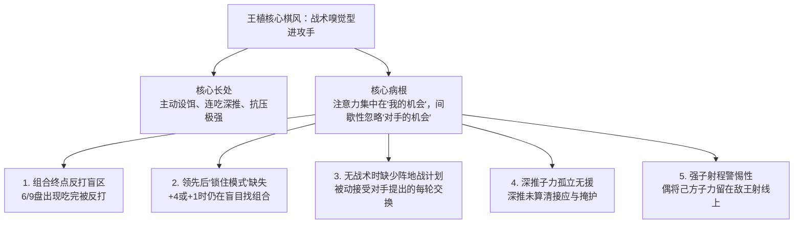
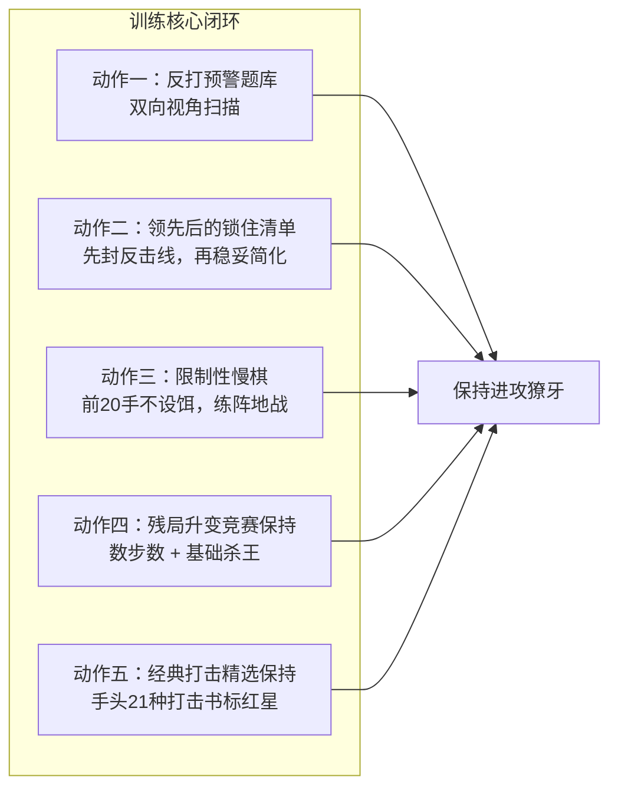

# 王植国际跳棋专属进阶训练方案（基于天津青少赛九轮实战诊断）

> **实战基线与分水岭**：总成绩 5 胜 2 和 2 负（全国第5名）。执白 3 胜 1 和保持不败；执黑仅负于全国冠亚军（李睿超、丁牧一），对其他对手 5 胜 2 和保持不败。已具备稳压第5名以下对手的统治力，正处于突破进军全国领奖台的质变临界点。

---

## 一、 棋风画像与五大结构性短板（诊断结论）

### 1. 核心底色与已经固化的资产（切忌过度矫正）

- **战术组合与设饵杀伤力极强**：R4（三套组合）、R8（落后时三连吃绝地反击升王）证明了他具备主动设计“诱吃 $\\rightarrow$ 借力 $\\rightarrow$ 连吃扫荡”的顶级杀手本能，这是冲击全国前三最值钱的资本。

- **逆境抗压与韧性极高**：输棋后下一轮必胜（R2负 $\\rightarrow$ R3胜，R6负 $\\rightarrow$ R7胜），局势转坏时不出现雪崩连败。

- **开局体系高度稳定**：白棋 32-28、黑棋 18-23 经受住全部 9 轮检验（前 15 步零吃亏），**现阶段无需扩充开局谱，保持即可**。

### 2. 阻碍他登顶的核心痛点

- **不是算力不够，而是注意力分配问题**：组合进行中全神贯注，但**“组合刚结束那一刻、优势到手那一刻、局面无战术那一刻”**，对对手资源的扫描雷达就停了。

---

## 二、 下一阶段五大针对性训练动作

### 动作一：把自己的 6 个实战局面做成“反打预警题库”（每周 2 次，每次 20 分钟）

- **素材来源**：实战中 6 个被反打的关键节点（R1 第24手前、R3 第25手前、R6 第22手后、R7 第24手后、R8 第32手前、R9 第25手前）。

- **双向训练法**：

  1. **正向做**：停在实战走棋前，强制写出“我走完后，对手所有能连吃的斜线与落点”，再决定走不走；

  2. **逆向做（换位思考）**：换到黑/白方视角，让他扮演李睿超、丁牧一，去找出击溃自己的那条反击线。

### 动作二：领先后的“三件事清单”（锁住胜利，每周 1 次）

只要子力领先（哪怕只多 1 子），强制执行三步闭环：

1. **查反击**：对手现在唯一能反扑的子/线在哪里？先封死或兑掉；

2. **做简化**：能不能用最安全的 1 换 1 缩小战局？能就换；

3. **停设饵**：进入优势转化期，**不再主动送饵、不打风险组合**。

### 动作三：限制性慢棋训练（阵地战与局面计划感，每周 1\~2 盘）

- **规则设定**：在 Lidraughts 上下 15\~20 分钟慢棋，设定特殊规则——**“前 20 手不主动送饵、不打弃子组合，只做对己方有利的交换、占领 28/23 中心、争夺先手步（Tempo）”**。

- **目的**：学会李睿超那种“没有战术也能通过优势交换慢慢磨死对手”的阵地战硬功夫。

### 动作四：王棋与升变竞赛保持（每两周 1 次）

- **升变比速度**：双方冲王时，先数各自步数，评估谁先升变、升王后第一步能否吃掉对方待升变子（以 R7 第53手为样板）。

- **残局基本定式**：掌握单王守大斜线、多王封锁单王的基本杀法。

### 动作五：维持经典战术打击库（每周 1 次，保持进攻獠牙）

- 继续刷手头那本 21 种经典打击教材，只刷**标红星的盲区题**，确保基础杀招依然保持 0.5 秒神经反射。

---

## 三、 每周极简训练时间表（总时长控制在 4\~5 小时内）

### 【工作日·短频专项】（每次 20\~25 分钟）

- **周一**：反打预警题库（实战 6 局反思与换位推演）

- **周二**：经典战术打击书（过 1 个章节，挑红星题）

- **周四**：领先后的“锁住清单”演练 + 王棋定式

### 【实战与复盘日】（每次 40\~50 分钟）

- **周三**：限制性慢棋 1 盘（前20手练阵地战）+ 引擎复盘

- **周末**：高质量自由慢棋 1 盘 + **四指标复盘**

---

## 四、 专属复盘评估：只看四个硬指标

以后每盘慢棋或比赛对局复盘，不再泛泛评价，只记录以下 **4 个量化数字**：

| 评估指标 | 含义与实战参照 | 阶段改进目标 |
| --- | --- | --- |
| **1. 组合后被反打丢子次数** | 组合打完后是否被对手抓盲区反噬（R6 为典型）。 | **稳步压降至 0 次** |
| **2. 子力最高峰与终局差值** | 评估优势转化能力（如 R6 是 +4 $\\rightarrow$ 负，R8 是 +2 $\\rightarrow$ 胜）。 | **全盘保持非负值** |
| **3. 升王首步是否在安全位** | 升王后第一步是否脱离敌子射程（R2 送王 vs R7 完美用王）。 | **100% 落在安全位** |
| **4. 无战术阶段的计划性评分** | 均势下是盲目接受交换，还是有中心推进意图（1\~3分）。 | **达到 2.5 分以上** |

---

> **晋阶总结**：王植已经是一个**“看得见自己机会”**的顶级战术天才；接下来通过这套方案，把他培养成一个**“也看得见对手机会、会下阵地战、能锁住优势”**的全面大师。跨过这道坎，全国前三与金牌领奖台指日可待！